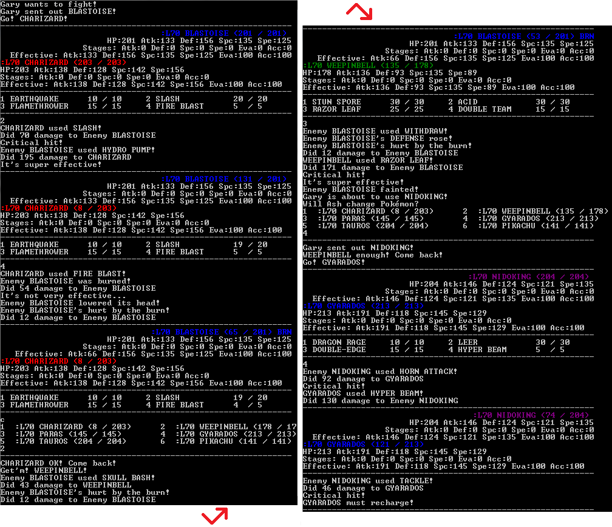

# PkMn

PkMn is an implementation of the Pokémon generation I battle system. It is split into three parts:

* **PkMn.Model** - Reads in static information on Pokémon species and moves and makes it available to be used by the rest of the program. See also: the XML files under [PkMn.Model\Generation-I](PkMn.Model/Generation-I).
* **PkMn.Instance** - Uses the data provided by PkMn.Model to caluculate the stats for indiviual Pokémon and orchestrate battles. See also: the classes [``Battle``](PkMn.Instance/Battle.cs), [``ActiveMonster``](PkMn.Instance/ActiveMonster.cs), and [``Monster``](PkMn.Instance/Monster.cs).
* **PkMn** - This is the exe I used as a test program while developing all of this. As it is included here it is set up to do a random 6 v 6 battle with all participants at level 70.

**For a graphical implementation of a Pokémon battle please check out [PkMn.Game](../../../PkMn.Game).**

## License

Pokémon and any and all related names, assets, and designs are trademark ™ and/or copyright © 1995-present The Pokémon Company / Nintendo / Creatures Inc. / GAME FREAK Inc.

Remaining program code is copyright © 2016 Matthew Blaine and released under the terms of the MIT License. Please see: [LICENSE.txt](LICENSE.txt).

## Controls

Use the number keys to select a move or type 'c' to go to the party menu. From there use the number keys to select a Pokémon to switch to or type 'b' to go back to the move menu. 

As text is output by the game (*"It's super effective!"*) hit enter to advance each line.

After both the player's and computer's turns the program outputs the active Pokémon's' stats including current stat stages and effective stat numbers. This is information as it was calculated in the original games, though it wouldn't display it anywhere.

## Download

Visit [**releases**](../../releases) to download the latest version.

## Screenshot

## Picking your team

By default it will generate both the player's and computer's teams randomly. In the same location as PkMn.exe there can optionally be another file, parties.xml. There are a few examples included in the released zip file. 

The program will only look at parties.xml, if it exists. Rename or copy the contents of the other example parties_*.xml files to try out other configurations, or create your own.

## Important notes

### Editing the configuration files

If editing parties.xml or any of the other XML files under in the Generation-I folder note that there is very little error handling surrounding the parsing of these files. Typos will cause the program to crash at startup and likely won't provide any useful error message. The config files being formatted correctly was just an assumption I made and never revisited, since these are things that wouldn't change all that often. Pokémon battles rarely devolve into spelling bees... heh.

Also species, moves, and element types refer to each other by name rather than by any ID number. So, for example, editing an individual Pokémon's moves in parties.xml or its species definition in Generation-I\species.xml so that it knows or can learn the move *"Stranth"* instead of *"Strength"* will unfortunately crash the program outright. By using their English names as keys it made the configs easier to read as you don't have to memorize or look up species and move ID numbers.

If using a parties.xml file to configure your team, the program will try to generate data for any information left out. So if you leave the stats and/or moves blank for a specific Pokémon it will generate them as the original games would have based on its species and level.

### How random teams are generated

Moves for the computer's team, when generated randomly, are filled in as a trainer or wild Pokémon would be generated in the original games. Which means they'll have the up to four moves they would have most recently learned at their current level.

Then for the player's team it does the same but I've also added an arbitrary chance for it to replace one of the Pokémon's moves with a move from the list of TMs and HMs its species can learn. It only does this when generating a move set for a team member from scratch, not if at least one move was specified for it in a parties.xml file. This was to make the game more interesting since this program only does battles and there's no opportunity to learn many of the moves otherwise. Also I noticed that in generation I for species that evolve via an evolution stone it pretty much assumes it already learned most of it's moves before evolving. So for instance a wild Raichu in the original games will only know Thunder Shock, Growl, and Thunder Wave. Which isn't very much fun.

The chance for a TM or HM to be randomly used is as follows:

* 100% if the Pokémon knows fewer than four moves (note that for something like Metapod it can't learn anything by TM or HM and will only know Harden no matter what)
* 60% if it has no further evolutions
* 30% otherwise, meaning if it still has at least one evolution ahead of it

Then there's a 60% chance it will grab a move that matches one of its elemental types if that's possible. Otherwise it picks a random TM or HM of a different type.

### Enemy AI

There is not any special logic behind the computers decisions. It picks moves entirely at random. Whenever a Pokémon faints it will always choose the next one in its party.

## Resources

These are the main resources I used while building all of this.

* <https://github.com/pret/pokered>
* <http://bulbapedia.bulbagarden.net/>
* <https://pokemonshowdown.com/damagecalc/>
* <http://www.smogon.com/dex/rb/pokemon/>

## Source

The source for PkMn is available at <https://github.com/mblaine/PkMn>.
